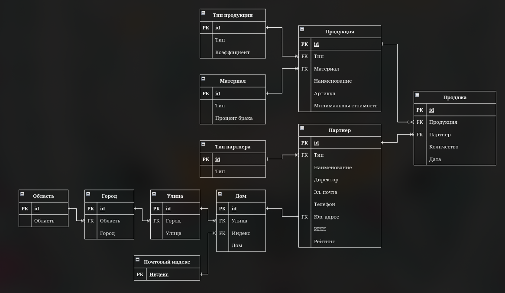

# МАСТЕР ПОЛ - ПАРТНЕРЫ

Программный модуль "Партнеры" для системы компании "Мастер пол".

Демонстрация работы модуля:

https://github.com/user-attachments/assets/0a3be660-decf-41ba-a43e-74d8c45a1ded

Схема БД:



## Начало работы

Эти инструкции предоставят вам копию проекта и помогут запустить на вашем локальном компьютере для разработки и тестирования.

### Необходимые условия

Для работы приложения необходимы библиотеки Django и Psycopg2:

```
pip install django psycopg2-binary
```

### Установка

Для установки необходимо скопировать данный репозиторий:

```
git clone https://github.com/fake-stmz/web-master-floor
cd web-master-floor/web_master_floor
```

### Настройка

Укажите в файле settings.py в web_master_floor/web_master_floor/ настройки подключений к вашей БД. Пример:

```
DATABASES = {
    'default': {
        'ENGINE': 'django.db.backends.СУБД',
        'NAME': 'ИМЯ_БД',
        'USER': 'ПОЛЬЗОВАТЕЛЬ',
        'PASSWORD': 'ПАРОЛЬ',
        'HOST': 'АДРЕС_ХОСТА',
        'PORT': ПОРТ
    }
}
```

Затем мигрируйте БД:

```
python manage.py migrate
```

### Запуск

Запуск проводится следующей командой:

```
python manage.py runserver
```

После чего сервер веб-приложения будет запущен на порту 8000

## Автор

* **STMZ** - [fake-stmz](https://github.com/fake-stmz)
